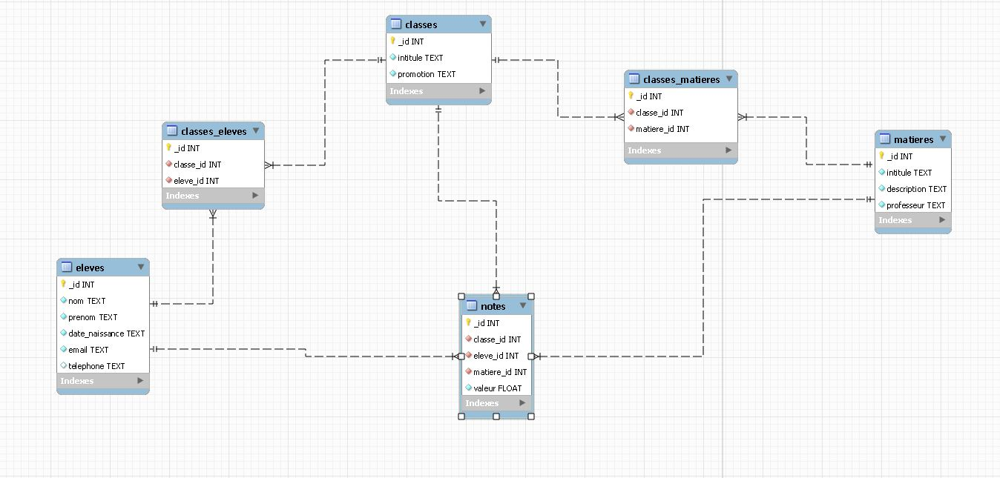

# Annuaire-CNAM

## Description

**L'annuaire du CNAM** est une application mobile développée par les auditeurs de la licence informatique en HTT dans le cadre du cours NFA025 : Mise en oeuvre programmation de smartphones et tablettes tactiles.

## Outils et versions

### Versions Utilisées

- **Android Gradle Plugin** : Version 8.5
- **Base de données** : SQLite, version 1
- **API Android** : API 24 "Nougat", Android 7.0
- **Version Java** : Java 21

### Dépendances et Outils Additionnels

- **Gradle** : Utilisé pour la gestion des dépendances et la compilation du projet.
- **Moteur de base de données** :
    - **SQLite** : Pour la gestion de la base de données embarquée.
      
  
### Configuration de l'Environnement

1. **Installer Android Studio** :
    - Téléchargez et installez Android Studio Koala | 2024.1.1 depuis [le site officiel](https://developer.android.com/studio).
2. **Versions d'Android** :
    - **Minimum** : API 24 "Nougat", Android 7.0

## Compatibilité

- **Compatibilité avec les émulateurs** : L'application est compatible avec les versions utilisées par nos émulateurs de développement.

## Limitations

Certaines fonctionnalités peuvent ne pas fonctionner correctement sur les versions d'Android antérieures à Nougat (7.0).